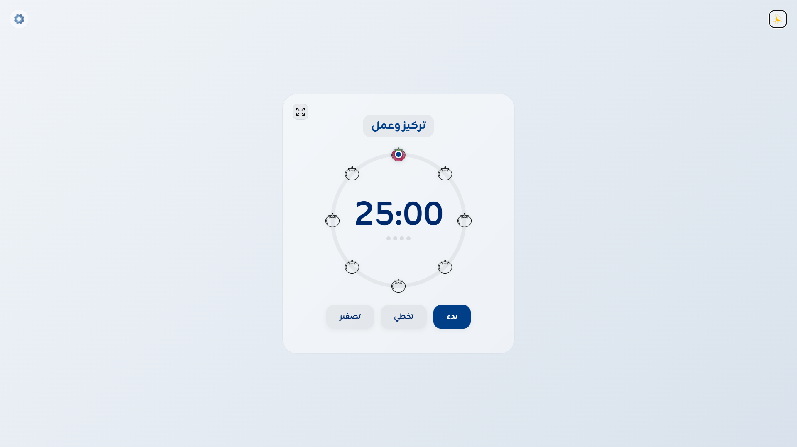
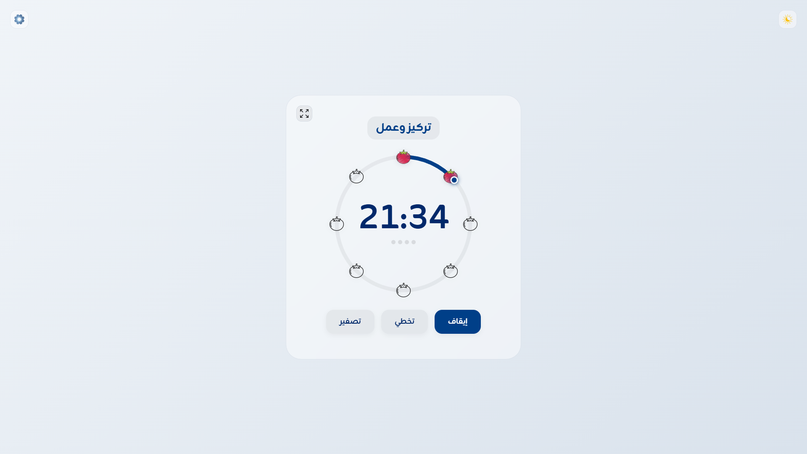
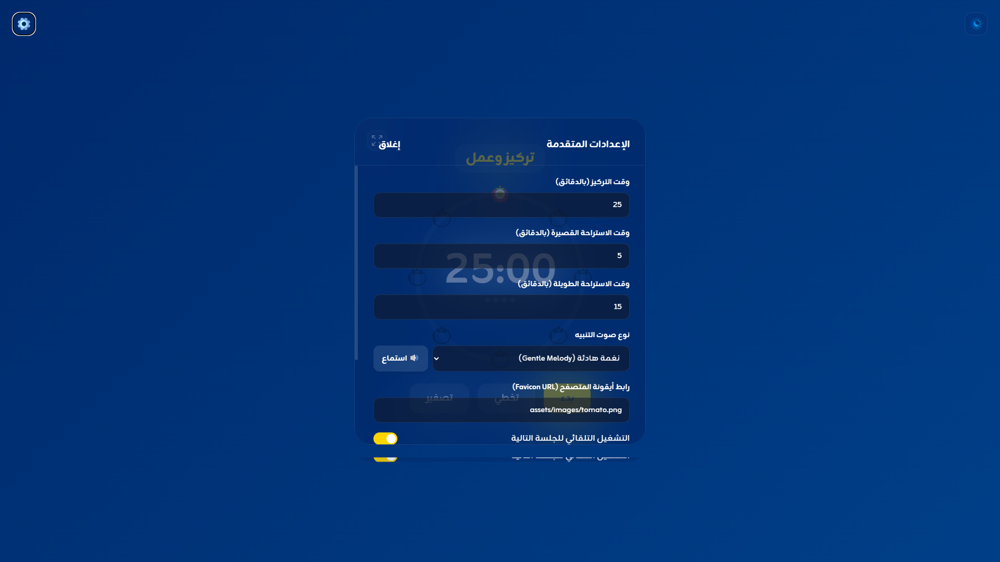

# Tomato Timer

A beautiful, distraction-free Pomodoro timer that lives in your browser. No installs. No sign-ups. Just you and the tomato.

## What It Does

Helps you work in focused 25-minute sprints with built-in breaks, because staring at a tomato is apparently very productive.

## Features

- Circular countdown timer with animated progress ring
- Light & dark themes with a single click
- Minimal focus mode (giant numbers, zero distractions)
- Multiple notification sounds (synth, chime, gentle melody) or bring your own
- Customizable work/break durations
- Track your Pomodoro cycles with visual dot indicators
- Tomato progress markers that change color as time passes
- Upload your own background image
- Browser tab shows the timer countdown
- Everything saves to your browser's localStorage
- Works offline, works anywhere

## Quick Start

Just open `Pomodoro.html` in any modern browser. That's it.

## Project Structure

```
Pomodoro.html
assets/
  images/     # Icons and tomato sprites
  sounds/     # Notification sounds
screenshots/  # App screenshots
```

## Customization

Click the gear icon to adjust work duration, break times, sounds, favicon, and background. All settings persist in your browser.

## Screenshots

### Light Theme
<p align="center">
  
</p>

### Dark Blue Theme
<p align="center">
  
</p>

### Minimal Focus Mode
<p align="center">
  
</p>

### Timer In Progress
<p align="center">
  
</p>

### Settings Panel
<p align="center">
  
</p>

### Browser Tab Timer
<p align="center">
  
</p>

## License

Do whatever you want with it. Ship it, fork it, tomato it.
